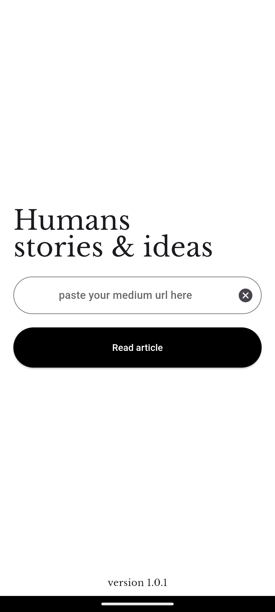

# Medium Parser

The Medium Parser is a Flutter application designed to parse articles from Medium and extract relevant data such as the title, author, publication date, and content. This tool can be used for various purposes, including data analysis, content aggregation, and more.

## Features

- Extract article titles, authors, publication dates, and content from Medium.
- Handle multiple articles parsing.
- Efficiently process large amounts of data.
- User-friendly interface with Flutter.

## UI

    
    

## Usage

1. **Add URLs:**

   - Open the app and enter the URLs of Medium articles you want to parse. Each URL should be added separately.

2. **Run the parser:**

   - Click the parse button to extract the data from the provided URLs.

3. **Output:**
   - The parsed data will be displayed in the app and can be saved or exported as needed.

## Configuration

The configuration of the Medium Parser can be modified in the app settings. You can adjust settings such as the output directory, logging level, and more.

## License

This project is licensed under the MIT License - see the [LICENSE](LICENSE) file for details.

## Acknowledgments

- Thanks to the Medium community for providing the content.
- Inspired by various web scraping and data parsing projects.

---

Happy Parsing!
